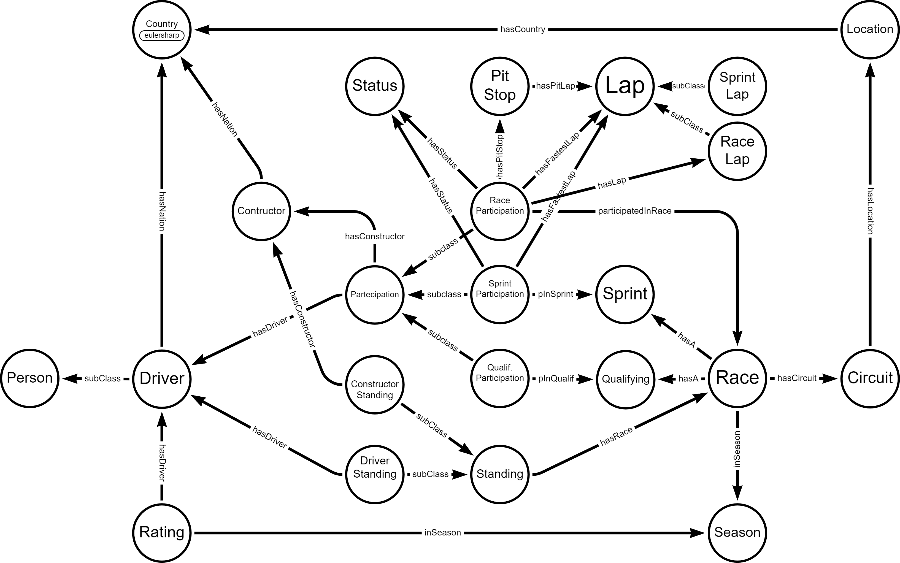

###

  

# FASTianF1
Group project for Database 2 course developed by Christian Marchiori and Fabio Zanini.

---
This repository contains:
- the ontology designed to model the F1 world (\Ontology)
- the visual graph (.png and .svg)
- the datasets used (\data)
- the jupyter notebook developed for data cleaning, ingestion and serialization (\Serialization)
- the serialization files of our rdf data (\data\rdf\)
- a notebook containing the queries (\Queries)
- other useful files

---
Data sources:
- Formula 1 data: [Ergast API](https://ergast.com/mrd/) or [Kaggle](https://www.kaggle.com/datasets/rohanrao/formula-1-world-championship-1950-2020)
- Ratings 2023 data: [EA Ratings API](https://ratings-api.ea.com/v2/entities/f1-23-drivers-ratings) of [F1 2023 official game](https://www.ea.com/it-it/games/f1/f1-23)
- Ratings older data: [GitHub](https://github.com/toUpperCase78/formula1-datasets)
- Country to Nationality csv: [GitHub](https://github.com/Imagin-io/country-nationality-list/tree/master)

---
Various instruction to make the jupyter notebook work:
- the path are compliant with windows path, so they use '\\\' . To make them work with macOS or Linux, they need to be changed with '/'.

---
Schema of the FASTianF1 ontology:

  

